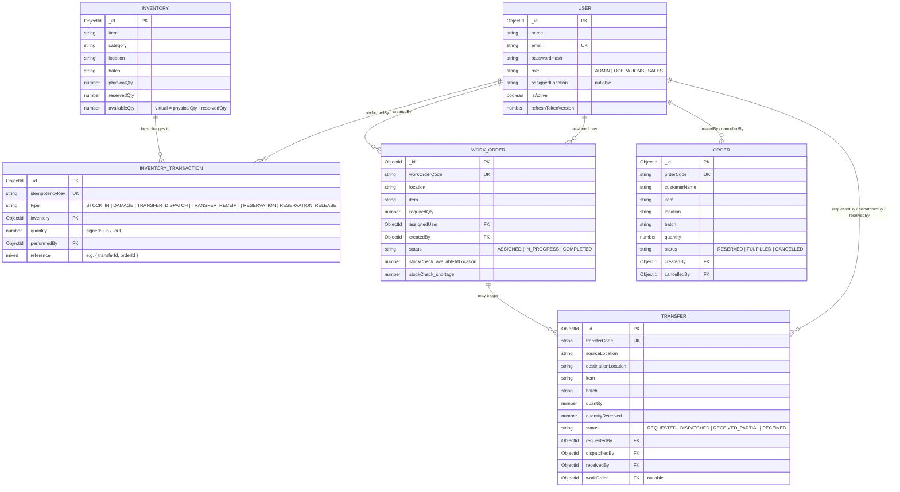

# Database Schema / ER Diagram



## Key design decisions

**`availableQty` is never stored.** It's a derived virtual (`physicalQty - reservedQty`)
computed at read time, so it can never drift out of sync with its inputs — there is no way
for a bug to update one but not the other.

**Every stock-changing operation is an atomic, guarded MongoDB update**, not a
read-check-then-write. For example, reserving stock for a customer order runs:

```js
Inventory.findOneAndUpdate(
  { item, location, batch, $expr: { $gte: [{ $subtract: ['$physicalQty', '$reservedQty'] }, qty] } },
  { $inc: { reservedQty: qty } }
)
```

The availability check and the increment happen as a single atomic document operation on
the MongoDB server. Two concurrent requests hitting the same document cannot both pass the
check — the second one always re-evaluates the *current* document state, so it's impossible
for both to succeed even without an application-level lock. This is what makes the
"two users reserve 80 + 50 against 100 available" scenario safe.

**Multi-document writes (reservation + order row, dispatch + ledger + transfer status,
etc.) are wrapped in Mongo replica-set transactions** (`session.withTransaction`) so that
either the whole operation lands or none of it does — no half-applied transfers or
orders with no matching inventory transaction.

**Every state-changing endpoint accepts an `idempotencyKey`.** If a request is retried
(double-click, network retry, etc.) with the same key, the operation returns the
already-applied result instead of double-applying the change. This is the mechanism that
also prevents a transfer from being received twice.
