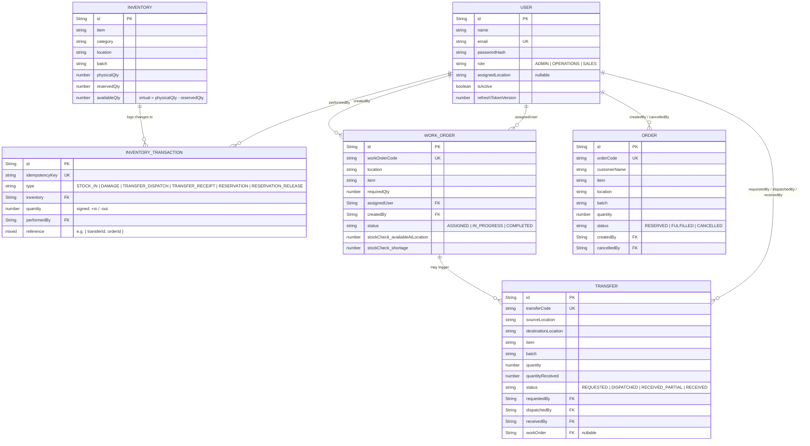

# Database Schema / ER Diagram



## Key design decisions

**`availableQty` is never stored.** It's a derived virtual (`physicalQty - reservedQty`)
computed at read time, so it can never drift out of sync with its inputs — there is no way
for a bug to update one but not the other.

**Every stock-changing operation is an atomic, guarded PostgreSQL transaction**, not a
read-check-then-write race condition. For example, reserving stock for a customer order runs:

```js
await prisma.$transaction(async (tx) => {
  const inv = await tx.inventory.findUnique({ where: { item_location_batch: ... } });
  if (inv.physicalQty - inv.reservedQty < qty) throw new Error("Not enough stock");
  
  await tx.inventory.update({
    where: { id: inv.id },
    data: { reservedQty: { increment: qty } }
  });
})
```

The availability check and the increment happen within an interactive transaction on
the PostgreSQL server. Two concurrent requests hitting the same row cannot both pass the
check because they evaluate the *current* transactional state, so it's impossible
for both to succeed even without an explicit application-level lock. This is what makes the
"two users reserve 80 + 50 against 100 available" scenario safe.

**Multi-document writes (reservation + order row, dispatch + ledger + transfer status,
etc.) are wrapped in PostgreSQL transactions** (`prisma.$transaction`) so that
either the whole operation lands or none of it does — no half-applied transfers or
orders with no matching inventory transaction.

**Every state-changing endpoint accepts an `idempotencyKey`.** If a request is retried
(double-click, network retry, etc.) with the same key, the operation returns the
already-applied result instead of double-applying the change. This is the mechanism that
also prevents a transfer from being received twice.

