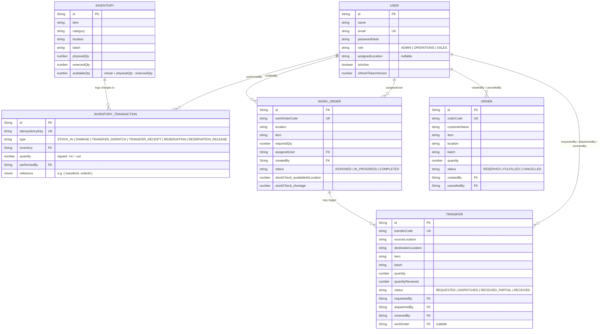

# Mini Operations ERP

A production-oriented full-stack Operations ERP covering:

**Inventory → Work Order → Stock Check → Internal Transfer / Shortage → Customer Reservation**

Built as a PERN application (PostgreSQL, Express, React, Node.js) with JWT auth,
role-based authorization, atomic/transactional inventory logic, and an idempotency
layer to protect against duplicate/retried requests.

---

## 1. Tech Stack

**Backend**
- Node.js + Express
- PostgreSQL + Prisma ORM (hosted on Supabase)
- JWT (access token + rotating httpOnly-cookie refresh token)
- bcryptjs for password hashing
- helmet, cors, hpp, express-rate-limit for hardening
- express-validator for request validation
- Jest + Supertest + prisma test environment for tests
- swagger-ui-express for interactive API docs

**Frontend**
- React 18 + Vite
- React Router v6
- Tailwind CSS
- Axios (with automatic access-token refresh interceptor)

---

## 2. Project Setup

### Prerequisites
- Node.js 18+
- MongoDB running **as a replica set** (required for `session.withTransaction()`).
  The easiest local option is a single-node replica set:

  ```bash
  mongod --replSet rs0 --dbpath /path/to/data --port 27017
  # then, once, in a mongo shell:
  mongosh --eval "rs.initiate()"
  ```

  Alternatively, use a free MongoDB Atlas cluster (Atlas clusters are replica sets
  by default) and drop its connection string into `DATABASE_URL`.

### Backend

```bash
cd backend
cp .env.example .env      # edit DATABASE_URL and JWT secrets
npm install
npm run seed               # creates demo Admin/Operations/Sales users + sample inventory
npm run dev                # starts on http://localhost:5000
```

Demo accounts created by the seed script:

| Role       | Email              | Password      | Assigned Location |
|------------|---------------------|---------------|--------------------|
| Admin      | admin@opserp.com    | Admin@12345   | (none — all locations) |
| Operations | ops@opserp.com      | Ops@12345     | Warehouse-A        |
| Sales      | sales@opserp.com    | Sales@12345   | Warehouse-A        |

### Frontend

```bash
cd frontend
cp .env.example .env       # VITE_API_URL=http://localhost:5000/api
npm install
npm run dev                 # starts on http://localhost:5173
```

Open `http://localhost:5173`, log in with any demo account above.

---

## 3. Database Setup

No manual schema creation needed — Mongoose creates collections and indexes on
first write. Key indexes:

- `Inventory`: unique compound index on `{ item, location, batch }`
- `InventoryTransaction`: unique index on `idempotencyKey` (powers duplicate-transaction
  prevention and idempotent retries)
- `WorkOrder.workOrderCode`, `Transfer.transferCode`, `Order.orderCode`: unique
- `User.email`: unique

See `ER-DIAGRAM.md` for the full schema and design rationale.



---

## 4. Environment Variables

**Backend (`backend/.env`)**

| Variable | Description |
|---|---|
| `NODE_ENV` | `development` / `production` / `test` |
| `PORT` | API port (default 5000) |
| `CLIENT_URL` | Frontend origin, used for CORS (default `http://localhost:5173`) |
| `DATABASE_URL` | MongoDB connection string — **must point at a replica set** |
| `JWT_ACCESS_SECRET` | Secret for signing short-lived access tokens |
| `JWT_REFRESH_SECRET` | Secret for signing refresh tokens (different from access secret) |
| `JWT_ACCESS_EXPIRES` | e.g. `15m` |
| `JWT_REFRESH_EXPIRES` | e.g. `7d` |
| `COOKIE_SECURE` | `true` in production (HTTPS only) |

**Frontend (`frontend/.env`)**

| Variable | Description |
|---|---|
| `VITE_API_URL` | Base URL of the backend API, e.g. `http://localhost:5000/api` |

The business logic itself has **no hard dependency on any specific hosting
provider** — it only needs a PostgreSQL database reachable via `DATABASE_URL` and
standard Node/Express hosting (Render, Railway, EC2, a container, etc.).

---

## 5. How to Run

1. Start MongoDB (as a replica set).
2. `cd backend && npm run seed` (first time only).
3. `cd backend && npm run dev`.
4. `cd frontend && npm run dev`.
5. Visit `http://localhost:5173` and log in.

---

## 6. How to Test

```bash
cd backend
npm test
```

Tests use `prisma test environment` to spin up a real, ephemeral single-node MongoDB
replica set per test run — no external database needed, and no test pollutes another.

> **Note on this submission's sandbox:** the automated test suite was written and
> syntax/logic-verified in this environment, but could not be *executed* here because
> `prisma test environment` needs to download a `mongod` binary from `fastdl.mongodb.org`,
> which this particular sandbox's network egress list doesn't include. It will run
> normally with `npm test` on a machine with normal internet access (and does not
> require your own MongoDB instance — the memory server handles that).

### Mandatory tests implemented (`backend/tests/`)

| # | Test | File |
|---|---|---|
| 1 | Cannot reserve more than available inventory (+ concurrent race case) | `order.test.js` |
| 2 | Cannot transfer more than available inventory | `transfer.test.js` |
| 3 | Destination stock increases only after transfer receipt (+ partial receipt) | `transfer.test.js` |
| 4 | Same transfer cannot be received twice | `transfer.test.js` |
| 5 | Unauthorized user cannot perform a restricted operation | `auth-authz.test.js` |

Plus supporting tests for login success/failure and order cancellation releasing
reserved stock.

---

## 7. API Documentation

Interactive Swagger UI is served at:

```
http://localhost:5000/api/docs
```

The raw OpenAPI spec lives at `backend/config/swagger.json`. A Postman collection
can be generated by importing that same file into Postman (`Import → File`).

---

## 8. Screens

1. **Login** — email/password, JWT session
2. **Inventory** — view/search stock across locations & batches, stock-in, mark damaged
3. **Work Orders** — Admin creates, automatic material/shortage check, status progression
4. **Internal Transfers** — request → dispatch → receive (supports partial receipt)
5. **Customer Orders** — create & reserve stock, cancel (releases reservation), fulfill

---

## 9. Roles & Permissions

| Action | Admin | Operations | Sales |
|---|---|---|---|
| Create Work Order | ✅ | ❌ | ❌ |
| Manage Inventory (stock-in, damage) | ✅ | ✅ | ❌ |
| Request/Dispatch/Receive Transfer | ✅ | ✅ | ❌ |
| Create/Cancel/Fulfill Customer Order | ✅ | ❌ | ✅ |
| View Inventory / Work Orders / Transfers / Orders | ✅ | ✅ | ✅ |

All authorization is enforced **server-side** in Express middleware
(`middleware/roles.js`) — the frontend only hides buttons for a better UX; it is
never the source of truth.

An additional `restrictToAssignedLocation` middleware is wired in but only takes
effect for users who have an `assignedLocation` set (Admins are always exempt) —
this backs the "restrict users to their assigned location" Live Verification
scenario without changing default behavior for anyone else.

---

## 10. Business Logic Highlights

- **Available Quantity** is always `physicalQty - reservedQty`, computed as a
  computed field — never stored, so it can't drift out of sync.
- **Negative inventory, invalid quantity, and reservation-beyond-available** are
  all rejected by atomic PostgreSQL transactions with row-level safety (see `docs/ER-DIAGRAM.md` for
  the exact pattern) — not application-level read-then-write checks, so they're
  safe under real concurrency.
- **Duplicate inventory transactions** are prevented via a required
  `idempotencyKey` on every mutating request, enforced with a unique constraint on `idempotencyKey`.
- **Work Order shortage** is computed automatically as
  `max(0, requiredQty - availableAtLocation)` at creation, and can be re-run
  on demand (e.g. after a transfer completes).
- **Transfer lifecycle** strictly separates dispatch (source ↓) from receipt
  (destination ↑) — destination inventory is provably untouched between those
  two events, and partial receipt is supported without prematurely closing the
  transfer.
- **Customer order cancellation** atomically releases the exact reserved
  quantity back to `availableQty`.

---

## 11. Live-Verification Readiness

The spec notes that shortlisted candidates will receive one small unannounced
change. Since several likely changes are foreseeable from the brief itself, this
submission already implements all four documented examples so the underlying
architecture can be explained and extended live:

- **Change 1 (Damaged stock):** `POST /api/inventory/:id/damage` — reduces
  `physicalQty` atomically, guarded so you can't damage more than is currently
  unreserved.
- **Change 2 (Partial transfer receipt):** `POST /api/transfers/:id/receive`
  accepts an optional `quantity` less than the remaining amount; status becomes
  `RECEIVED_PARTIAL` until fully received.
- **Change 3 (Cancel order, release reservation):** `POST /api/orders/:id/cancel`
  atomically decrements `reservedQty` by the order's quantity.
- **Change 4 (Restrict to assigned location):** `User.assignedLocation` +
  `restrictToAssignedLocation` middleware, applied to the location-scoped
  create endpoints (Inventory, Work Orders, Orders).

---

## 12. Git History Note

This repository is delivered as a complete snapshot for review. When pushing to
your own Git remote, commit in logical increments (models → auth → inventory →
work orders → transfers → orders → frontend → tests → docs) rather than as a
single commit, per the assignment's git history requirement.

